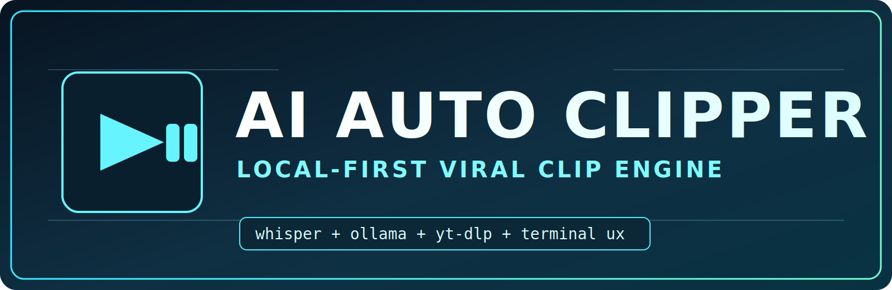

# AI AUTO CLIPPER

<p align="center">
  
</p>

🎬 **AI AUTO CLIPPER** is a local-first clipping project, basically **OpusClip vibes, but free**.  
🤖 Extract long and short clips from your videos, tune advanced settings, and get exactly the output style you want.  
🔒 Everything runs on your machine with Whisper + Ollama + yt-dlp.

## Why This Project
- 🧠 AI clip discovery with strict JSON output handling and retry logic
- 🎯 Long-form and short-form clip extraction in one pipeline
- 🛠️ Setup Wizard + Dashboard for real-world usage, not just scripts
- 📥 YouTube queue + channel fetch system built-in
- ⚙️ Hardware-aware runtime tuning and model policy enforcement (`thinking` models, `>=8b`)

## Requirements
- `Python` (3.10+ recommended)
- `Git`
- `ffmpeg` (must be available in `PATH`)
- `Ollama` (running locally, default `http://localhost:11434`)

## Windows Quick Start

### 1. Check dependencies
```powershell
python --version
git --version
ffmpeg -version
ollama --version
```

If something is missing, install quickly with:
```powershell
winget install --id Python.Python.3.11 -e
winget install --id Git.Git -e
winget install --id Gyan.FFmpeg -e
winget install --id Ollama.Ollama -e
```

### 2. Clone and run
```powershell
git clone https://github.com/wessel05j/AI_Auto_clipper.git
cd AI_Auto_clipper
.\run.bat
```

Alternative launcher:
```powershell
.\run.ps1
```

`run.bat` / `run.ps1` automatically create `venv`, install deps (`setup_env.py`), and start the app.

## macOS / Linux Quick Start

### 1. Check dependencies
```bash
python3 --version
git --version
ffmpeg -version
ollama --version
```

### 2. Clone and run
```bash
git clone https://github.com/wessel05j/AI_Auto_clipper.git
cd AI_Auto_clipper
python3 -m venv venv
source venv/bin/activate
python setup_env.py --torch auto
python main.py
```

Notes:
- The bundled launcher scripts are Windows-oriented (`.bat` / `.ps1`).
- On macOS/Linux, run via the commands above.

## First Run Experience
1. 🚀 Runtime layout is prepared (`input/`, `output/`, `temp/`, `config/`, `logs/`, `system/`).
2. 🔍 Config is validated (`config/config.json`).
3. 🧙 If config is missing/invalid, Setup Wizard launches automatically.
4. 📊 Dashboard opens after setup and lets you launch clipping, edit settings, manage queues, and view logs.

## How Clipping Works
1. 📥 Optional YouTube download from queued links and/or channel fetch.
2. 📝 Whisper transcription turns video audio into timestamped transcript segments.
3. 🧩 Transcript chunking keeps prompt size within token budget.
4. 🤖 AI clipping scans chunks (plus optional bridge chunks) using Ollama.
5. 🔗 Segment merge combines nearby candidates using `merge_distance_seconds`.
6. ✅ Duration filtering enforces constraints (including "at least X seconds" from your query).
7. ✂️ Clip extraction writes final `.mp4` clips to output.
8. 📦 Source video is archived to `temp/` and cleanup policy is applied.

## Architecture (Professional Overview)

### Entry + Bootstrap
- `run.bat` / `run.ps1`: top-level launch entrypoints.
- `launcher/run.bat` / `launcher/run.ps1`: create/activate venv, call `setup_env.py`, then `main.py`.
- `setup_env.py`: installs Python deps, resolves Torch mode (CPU/CUDA), stores setup cache in `system/setup_state.json`, warns about missing external tools.

### Application Core
- `main.py`: startup orchestration.
  - Ensures folders exist.
  - Config validation + migration fallback.
  - Starts Setup Wizard or Dashboard.
- `core/engine.py`: runtime orchestrator.
  - Download -> transcribe -> chunk -> AI scan -> merge -> filter -> extract -> archive.
  - Writes live progress to `system/status.json`.
  - Handles temporary cleanup and resource offload (Whisper + CUDA + Ollama).
- `core/ai_pipeline.py`: Ollama chat layer.
  - Chunk scanner with retries and strict parsing.
  - JSON cleaning/repair fallback for resilient outputs.
- `core/clipping.py`: transcript merge and final video cutting with MoviePy.
- `core/yt_handler.py`: YouTube ingestion.
  - URL normalization, channel RSS fetch, history tracking.
  - Multi-strategy yt-dlp download with format probing.
- `core/format_checker.py`: format fallback policy (`2K -> 1080p -> progressive -> generic`).

### User Interface Layer
- `ui/setup_wizard.py`: guided first-run setup.
  - Hardware detect, model recommendation, token plan, config generation.
- `ui/dashboard.py`: operational control center.
  - Settings editor, queue manager, channel manager, logs viewer, info panel.
- `ui/components.py`: shared terminal components (logo panel, clear, editor integration).

### Utilities + Contracts
- `utils/validators.py`: schema defaults, validation, config migration, profile I/O.
- `utils/model_selector.py`: model policy, Ollama availability, token planning helpers.
- `utils/hardware_detect.py`: CPU/RAM/GPU probing and runtime budget estimates.
- `utils/logging_setup.py`: rotating file logs + console log policy.

## Key Runtime Files
- `config/config.json`: primary app config (all runtime behavior).
- `config/hardware_profile.json`: detected hardware snapshot.
- `config/model_profile.json`: selected model + token planning details.
- `system/setup_state.json`: environment/bootstrap cache.
- `system/status.json`: current engine progress.
- `system/downloaded_youtube_links.txt`: downloaded history.
- `system/fetched_youtube_links.txt`: fetched history.
- `logs/app.log`: rotating runtime logs.

## Folder Map
```text
AI_Auto_clipper/
|-- assets/
|   `-- ai-auto-clipper-logo.svg
|-- launcher/
|   |-- run.bat
|   `-- run.ps1
|-- core/
|   |-- engine.py
|   |-- ai_pipeline.py
|   |-- clipping.py
|   |-- yt_handler.py
|   `-- format_checker.py
|-- ui/
|   |-- setup_wizard.py
|   |-- dashboard.py
|   `-- components.py
|-- utils/
|   |-- validators.py
|   |-- model_selector.py
|   |-- hardware_detect.py
|   `-- logging_setup.py
|-- config/
|-- input/
|-- output/
|-- temp/
|-- system/
|-- logs/
|-- setup_env.py
|-- main.py
|-- run.bat
`-- run.ps1
```

## Notes
- Input videos go in `input/`.
- Exported clips go to `output/` (or your custom output path from setup/settings).
- Processed source videos are moved to `temp/`.
- Model policy enforces thinking-capable models with at least 8b parameters.
- AI output parsing is strict by design to keep extraction stable.

## License
Apache License 2.0 (`LICENSE`)
